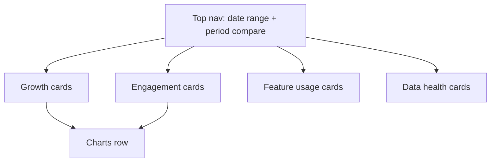

# Admin Dashboard & Analytics Specification

This document defines the first set of admin metrics for Hokie Nutrition and the
privacy boundaries that govern what admins can and cannot see. It is the source
of truth for building the web-first admin dashboard and the analytics events that
feed it.

Guiding principle: **admins see aggregates, not health profiles.** The dashboard
answers "how is the product doing?" not "what is user X eating?"

---

## 1. Audience & Access

- Admin dashboard is a separate web app, not part of the consumer iOS app.
- Access is restricted to accounts with role `admin` (and later `analyst`).
- All admin access is authenticated and audit-logged (who viewed what, when).
- Roles (MVP):
  - `admin`: full dashboard, feature flags, data-sync controls.
  - `analyst` (optional): read-only dashboard, no controls. Can be deferred.

---

## 2. First Metrics (MVP)

Organized into four cards/sections. Each metric lists its definition and source
event(s). All are computed over a selectable date range (default last 28 days)
with a comparison to the previous period.

### 2.1 Growth

| Metric | Definition | Source |
|---|---|---|
| Total users | Count of all accounts | `users` table |
| New signups | Accounts created in range | `account_created` |
| Email-verified rate | Verified / signups | `email_verified` |
| Onboarding completion rate | `onboardingCompletedAt` set / signups | `onboarding_completed` |
| Signup -> first recommendation | Median time to first rec view | `recommendation_viewed` |

### 2.2 Engagement

| Metric | Definition | Source |
|---|---|---|
| DAU / WAU / MAU | Distinct active users per window | `app_opened` |
| WAU/MAU stickiness | WAU / MAU ratio | derived |
| Location opt-in rate | Users granting location / active users | `location_permission` |
| Recommendation CTR | Item taps / rec impressions | `recommendation_viewed`, `recommendation_clicked` |
| Recommendation override rate | Rejections / rec impressions | `recommendation_rejected` |
| Avg recs viewed per session | impressions / sessions | derived |

### 2.3 Feature Usage

| Metric | Definition | Source |
|---|---|---|
| Custom bowls created | New saved bowls in range | `bowl_created` |
| Bowls per active user | bowls / active users | derived |
| Favorites added | Items/venues favorited | `favorite_added` |
| Notification opt-in rate | Push-enabled / active users | `notif_permission` |
| Notification engagement | Opens from notif / notifs sent | `notif_opened` |

### 2.4 Data Health (FoodPro ingestion)

| Metric | Definition | Source |
|---|---|---|
| Last successful scrape | Timestamp of latest good run | ingestion job |
| Scrape success rate | Successful runs / total runs | ingestion job |
| Items ingested | Count in latest snapshot | ingestion job |
| Venues covered | Distinct venues in latest snapshot | ingestion job |
| Items missing macros | Items with null calorie/macros | derived |
| Data freshness | Now - last successful scrape | derived |

### 2.5 Charts

- Signup growth over time (line, daily/weekly toggle).
- Active users (DAU/WAU/MAU) over time.
- Recommendation usage by dining hall (bar) - aggregated, venue-level only.
- Goal distribution (pie/bar): share of users per `goal` - aggregated counts only.
- Ingestion success timeline (status strip).

---

## 3. Privacy Boundaries

These rules are mandatory and constrain both the data model and the UI.

### 3.1 What admins CAN see

- Aggregate counts and rates (totals, percentages, medians).
- Distributions across cohorts where each bucket has a **minimum of 10 users**
  (small-bucket suppression to prevent re-identification).
- Venue-level recommendation/usage stats.
- Operational data: ingestion status, error logs, feature-flag state.

### 3.2 What admins CANNOT see

- Individual users' height, weight, age, sex, DOB, or computed calorie/macro
  targets.
- Individual users' precise location or location history.
- Individual users' specific food choices, saved bowls contents, or dislikes tied
  to identity.
- Any direct render of a single user's health profile in the dashboard.

### 3.3 Identity handling

- Analytics events reference users by a stable **pseudonymous analytics ID**, not
  email/name/phone. The mapping table is access-controlled and not exposed in the
  dashboard.
- A minimal user-admin view (for support: find account by email, see signup date,
  verification status, resend verification, disable/delete account) is a
  **separate, permissioned, audit-logged** surface - NOT the analytics dashboard.
  It still must not display health metrics or location.

### 3.4 Aggregation & suppression rules

- Cohort breakdowns suppress buckets with `< 10` users (show "—" / "low volume").
- Location is never stored at user granularity for analytics; only the resolved
  **quadrant** and the **chosen/recommended venue** at recommendation time are
  logged (region- and venue-level, never raw coordinates).
- Free-text fields (dislikes) are never surfaced in admin views.

### 3.5 Compliance hooks

- Account deletion removes PII and unlinks the analytics ID per the PRD's
  "delete account and associated personal data" requirement; aggregate counts may
  retain de-identified event rows.
- Document data retention windows for raw events (e.g., 13 months) vs. aggregates
  (indefinite, de-identified).
- All dashboard and support-tool access is written to an admin audit log.

---

## 4. Analytics Event Catalog (MVP)

Minimal event set needed to compute every metric above. Each event carries
`{ analyticsId, timestamp, appVersion, platform }` plus listed properties. No PII,
no coordinates.

| Event | Properties | Powers |
|---|---|---|
| `account_created` | authMethod | signups |
| `email_verified` | — | verification rate |
| `onboarding_completed` | goal | completion rate, goal distribution |
| `app_opened` | — | DAU/WAU/MAU |
| `location_permission` | status (granted/denied) | location opt-in |
| `recommendation_viewed` | meal, quadrant, venueId, count | impressions, CTR |
| `recommendation_clicked` | meal, quadrant, venueId, itemId, rank | CTR, usage by hall |
| `recommendation_rejected` | meal, proposedVenueId, proposedRestaurantId | override rate, preferred venues |
| `bowl_created` | venueId | bowls created |
| `favorite_added` | type (item/venue/bowl) | favorites |
| `notif_permission` | status | notif opt-in |
| `notif_opened` | notifType | notif engagement |

Note: `itemId`/`venueId` describe the catalog, not the person; they reveal what
was recommended, not a person's health data.

---

## 5. Dashboard Layout (web)

- Top bar: date-range picker, previous-period comparison toggle, environment label.
- Four KPI card rows (Growth, Engagement, Feature Usage, Data Health).
- Charts row beneath the KPIs.
- Hokie color theme (Chicago Maroon / Burnt Orange), clean analytics styling.
- A small "Data Health" banner turns red if last successful scrape is stale
  (e.g., > 36h), matching the PRD's "alert admins when ingestion fails."

---

## 6. Out of Scope (later)

- Cohort retention curves and funnels beyond signup -> first recommendation.
- Per-user behavioral drill-down (intentionally excluded for privacy).
- A/B experiment reporting.
- Revenue/cost dashboards.
- "Macro Tracking Activity / meals logged per day" (shown in the design mockup)
  depends on meal logging, which is V2. Defer this card until logging ships; see
  the scope gaps in `design-system.md`.
