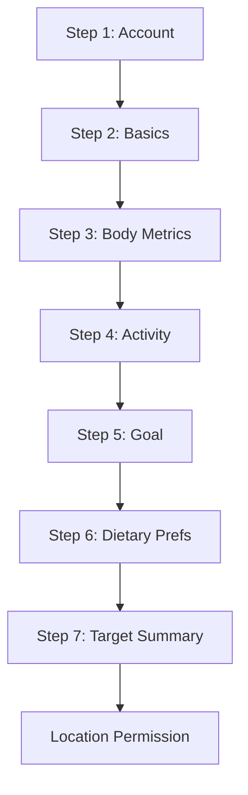

# Onboarding & Nutrition Targets Specification

This document finalizes the onboarding flow for Hokie Nutrition: the exact fields
collected, the supported goal options, and the formulas used to compute each
user's daily calorie and macro targets. It is the source of truth for building
the signup/onboarding screens and the target-calculation service.

Related: see the Stitch design prompts in the PRD plan for the matching UI.

---

## 1. Flow Overview

Onboarding is split into short steps so it feels fast on a phone. Each step maps
to one screen. Required fields block progression; optional fields can be skipped.



Design principles:

- Ask the minimum needed to compute a credible target. Everything else is optional.
- Show a live or final estimate so the user sees value immediately.
- Always let the user override the computed targets manually.
- No SMS at launch: phone is optional and unverified in MVP (email verification only).

---

## 2. Fields

Legend: **R** = required, **O** = optional.

### Step 1 - Account

| Field | Key | Type | Req | Validation / Notes |
|---|---|---|---|---|
| Full name | `name` | string | R | 1-80 chars |
| VT Email | `email` | string | R | **Must end in `@vt.edu`** (see rule below); used for login + verification |
| Phone | `phone` | string | O | E.164 if provided; not verified in MVP |
| Password | `password` | string | R | Min 8 chars, 1 letter + 1 number (skip if using OAuth) |

#### VT email rule

Signup is restricted to Virginia Tech students, so the email must be a valid
`@vt.edu` address.

- Validation regex (case-insensitive): `^[A-Za-z0-9._%+-]+@vt\.edu$`
  - Trim surrounding whitespace and lowercase the domain before validating.
  - Accept any local part VT issues (PIDs and name-based aliases both end in
    `@vt.edu`). Do **not** accept subdomains like `@cs.vt.edu` unless we later
    decide to; keep it to exactly `vt.edu` for MVP.
- UI: field label is "VT Email", placeholder `student@vt.edu` (matches design).
- Inline error copy when it fails: "Please use your @vt.edu email."
- This is enforced client-side for fast feedback **and** server-side at account
  creation (never trust the client). The OAuth path (if added) must also assert
  the verified email ends in `@vt.edu`, otherwise reject the signup.
- Resolves the open question "Should users be required to use a Virginia Tech
  email" -> **yes, required.**

### Step 2 - Basics

| Field | Key | Type | Req | Validation / Notes |
|---|---|---|---|---|
| Date of birth | `dob` | date | R | Derive `age`; must be 13+ (App Store / privacy) |
| Sex assigned at birth | `sex` | enum | R | `male` \| `female`. Used only for BMR formula. Copy explains why. |
| Class year | `classYear` | enum | O | `freshman`\|`sophomore`\|`junior`\|`senior`\|`grad`\|`other` |

> Note on `sex`: the Mifflin-St Jeor BMR equation requires a male/female
> coefficient. We collect it strictly for the calculation, label it clearly, and
> never expose it to admins. A future version can offer a manual BMR override to
> avoid requiring this field.

### Step 3 - Body Metrics

| Field | Key | Type | Req | Validation / Notes |
|---|---|---|---|---|
| Height | `heightCm` | number | R | Stored in cm; UI offers ft/in toggle. Range 120-230 cm |
| Weight | `weightKg` | number | R | Stored in kg; UI offers lb toggle. Range 35-250 kg |
| Target weight | `targetWeightKg` | number | O | Only relevant for cutting/bulking; range 35-250 kg |

Unit handling: store SI internally (`cm`, `kg`). Persist the user's display
preference (`units: imperial | metric`); **default `imperial`** (ft/in, lb) since
the designs and the US student audience expect it. Convert at the UI boundary.

### Step 4 - Activity

| Field | Key | Type | Req | Validation / Notes |
|---|---|---|---|---|
| Workout frequency | `workoutsPerWeek` | int | R | 0-14 |
| Activity level | `activityLevel` | enum | R | See activity multipliers below |

### Step 5 - Goal

| Field | Key | Type | Req | Validation / Notes |
|---|---|---|---|---|
| Gym goal | `goal` | enum | R | See goal options below |
| Pace (cut/bulk only) | `pace` | enum | O | `relaxed`\|`steady`\|`aggressive`; default `steady` |
| Protein emphasis | `proteinEmphasis` | enum | O | `standard`\|`high`; default depends on goal |

### Step 6 - Dietary Preferences

| Field | Key | Type | Req | Validation / Notes |
|---|---|---|---|---|
| Dietary pattern | `dietaryPattern` | enum | O | `none`\|`vegetarian`\|`vegan`\|`pescatarian`\|`halal` |
| Allergen avoidances | `allergens` | string[] | O | Multi-select from FoodPro allergen set (see data spec) |
| Disliked ingredients | `dislikes` | string[] | O | Free-ish tags; used to down-rank items |

### Step 7 - Target Summary

No input fields. Displays computed `calorieTarget`, `proteinTarget`,
`carbTarget`, `fatTarget` with an "Edit targets" affordance that sets
`targetsOverridden = true` and stores manual values.

---

## 3. Goal Options

The MVP supports these goals. Each maps to a calorie adjustment relative to
maintenance (TDEE) and a default macro strategy.

| Goal | `goal` key | Calorie adjustment | Default protein emphasis | Notes |
|---|---|---|---|---|
| Cutting | `cutting` | TDEE - deficit (pace-based) | high | Floor at BMR; never below safe minimum |
| Bulking | `bulking` | TDEE + surplus (pace-based) | high | Lean-gain default surplus |
| Staying lean | `lean` | TDEE (maintenance) | high | Recomposition feel |
| Maintenance | `maintenance` | TDEE | standard | Neutral |
| High protein | `high_protein` | TDEE | high | Calories neutral, protein-forward |
| Balanced eating | `balanced` | TDEE | standard | General healthy eating |

Pace adjustments (applied to cutting/bulking only):

| Pace | Cutting deficit | Bulking surplus |
|---|---|---|
| `relaxed` | -250 kcal | +150 kcal |
| `steady` (default) | -500 kcal | +300 kcal |
| `aggressive` | -750 kcal | +500 kcal |

Safety: the final calorie target is clamped so it is never below the user's BMR
and never below a hard floor of 1200 kcal (female) / 1500 kcal (male). If a
deficit would breach the floor, clamp and surface a gentle note. This satisfies
the PRD's "be cautious with aggressive cutting" requirement.

---

## 4. Nutrition Target Calculation

All math is deterministic and transparent. The user can always override the
result. The computed values are recalculated whenever any input changes (weight,
activity, goal, pace).

### 4.1 BMR - Mifflin-St Jeor

```
BMR (male)   = 10*weightKg + 6.25*heightCm - 5*age + 5
BMR (female) = 10*weightKg + 6.25*heightCm - 5*age - 161
```

### 4.2 TDEE - apply activity multiplier

```
TDEE = BMR * activityFactor
```

| `activityLevel` | Description | `activityFactor` |
|---|---|---|
| `sedentary` | Little/no exercise | 1.2 |
| `light` | 1-3 workouts/week | 1.375 |
| `moderate` | 3-5 workouts/week | 1.55 |
| `active` | 6-7 workouts/week | 1.725 |
| `very_active` | Hard training / 2x day | 1.9 |

If `activityLevel` and `workoutsPerWeek` disagree, trust the explicit
`activityLevel` selection (it is the required field). `workoutsPerWeek` is used
as a secondary signal and to suggest a default activity level in the UI.

### 4.3 Calorie target - apply goal adjustment

```
calorieTargetRaw = TDEE + goalAdjustment   // goalAdjustment per tables above
calorieTarget    = clamp(calorieTargetRaw, calorieFloor, +inf)
calorieFloor     = max(BMR, hardFloor)      // hardFloor = 1200 F / 1500 M
```

### 4.4 Macro targets

Protein is set per body weight (most robust for gym goals), then fat as a
percentage of calories, then carbs fill the remainder.

```
proteinPerKg = (proteinEmphasis == high) ? 2.0 : 1.6     // g per kg bodyweight
proteinTarget_g = round(proteinPerKg * weightKg)

fatTarget_g = round((calorieTarget * fatPct) / 9)         // fatPct = 0.25
proteinCals = proteinTarget_g * 4
fatCals     = fatTarget_g * 9
carbTarget_g = round(max(0, (calorieTarget - proteinCals - fatCals)) / 4)
```

Calorie-per-gram constants: protein = 4, carbs = 4, fat = 9.

Edge case: for aggressive cuts on lighter users, protein cals + fat cals can
approach the calorie target, leaving few carbs. That is acceptable; carbs are
allowed to be low but never negative (clamped at 0).

### 4.5 Worked example

Input: male, 25y, 180 cm, 80 kg, `activityLevel = moderate`, `goal = cutting`,
`pace = steady`, `proteinEmphasis = high`.

```
BMR  = 10*80 + 6.25*180 - 5*25 + 5 = 800 + 1125 - 125 + 5 = 1805
TDEE = 1805 * 1.55 = 2797.75 -> 2798
calorieTargetRaw = 2798 - 500 = 2298  (>= floor, ok)
proteinTarget_g  = round(2.0 * 80) = 160 g  -> 640 kcal
fatTarget_g      = round(2298 * 0.25 / 9) = round(63.8) = 64 g -> 576 kcal
carbTarget_g     = round((2298 - 640 - 576) / 4) = round(270.5) = 270 g
```

Result: ~2298 kcal, 160 g protein, 270 g carbs, 64 g fat.

---

## 5. Persisted Profile Schema (logical)

```jsonc
{
  "userId": "uuid",
  "name": "string",
  "email": "string",
  "phone": "string|null",
  "dob": "date",
  "sex": "male|female",
  "classYear": "enum|null",
  "heightCm": 0,
  "weightKg": 0,
  "targetWeightKg": "number|null",
  "units": "imperial|metric",   // default imperial
  "workoutsPerWeek": 0,
  "activityLevel": "sedentary|light|moderate|active|very_active",
  "goal": "cutting|bulking|lean|maintenance|high_protein|balanced",
  "pace": "relaxed|steady|aggressive|null",
  "proteinEmphasis": "standard|high",
  "dietaryPattern": "none|vegetarian|vegan|pescatarian|halal",
  "allergens": ["string"],
  "dislikes": ["string"],

  // computed (recalculated on input change unless overridden)
  "calorieTarget": 0,
  "proteinTarget": 0,
  "carbTarget": 0,
  "fatTarget": 0,
  "targetsOverridden": false,

  "createdAt": "timestamp",
  "onboardingCompletedAt": "timestamp|null"
}
```

`onboardingCompletedAt` powers the "onboarding completion rate" admin metric.

---

## 6. Validation & UX Rules

- Block "Next" until required fields on the current step are valid; inline errors.
- Height/weight: enforce numeric ranges; reject obviously bad values.
- Age computed from `dob`; if under 13, stop signup with a clear message.
- Recompute targets live on Step 7; if `targetsOverridden`, show "Custom" badge
  and a "Reset to recommended" action.
- Persist partial progress so a dropped session can resume (store step index).
- Goal-conditional fields: only show `pace` for cutting/bulking; only show
  `targetWeightKg` for cutting/bulking.
