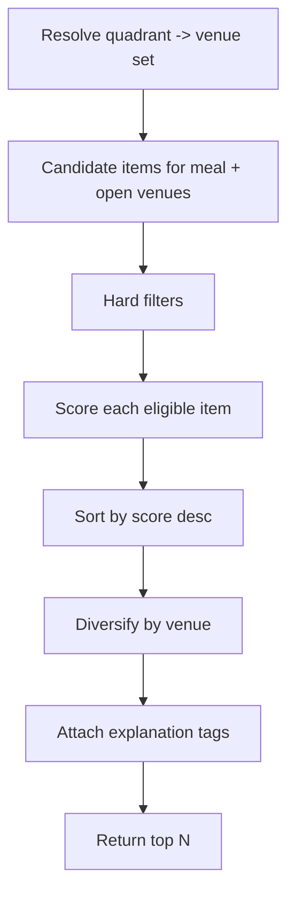
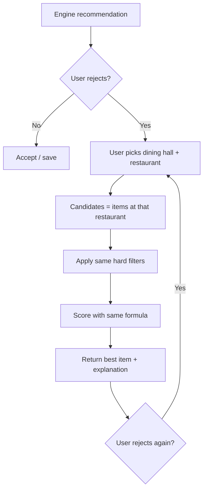

# Recommendation Engine Specification

This document specifies how Hokie Nutrition ranks food items for a user. It
defines hard filters (what is eligible) and the scoring formula (how eligible
items are ordered), using macros, calories, location, preferences, and dietary
restrictions.

Scope note: MVP recommends **per meal** (one eating occasion at a time). There
is no meal logging in MVP, so "remaining macros today" is **not** an input.
That is a V2 enhancement and is called out where relevant.

---

## 1. Pipeline Overview



1. **Resolve venue set by quadrant** (Section 4.5): map the user's location to one
   of the campus quadrants and use that quadrant's pre-determined venue list. If
   location is unavailable, the user picks a quadrant or a specific dining hall.
2. Build candidate set: items served for the target meal at the quadrant's venues
   that are open (or all of them if open-hours data is unavailable).
3. Apply hard filters to remove ineligible items.
4. Score each remaining item (0-100).
5. Sort descending; apply light venue diversification.
6. Attach human-readable explanation tags.
7. Return top N (default N = 20).

There is also a **reject-and-propose** path (Section 4.7) where the user rejects
the recommendation and names a dining hall + restaurant; the engine then returns
the single best meal from that restaurant.

---

## 2. Inputs

### Per-user (from profile)

- `goal`, `calorieTarget`, `proteinTarget`, `carbTarget`, `fatTarget`
- `proteinEmphasis`
- `dietaryPattern`, `allergens`, `dislikes`
- `userLocation` (optional; lat/lng) - used **only** to resolve the user's
  campus quadrant, then discarded (see privacy note in Section 4.5)
- `selectedQuadrant` or `selectedDiningHall` (manual fallback when location is off)

### Per-meal context

- `meal` = `breakfast | lunch | dinner | snack` (inferred from time of day, user-overridable)
- `mealCalorieTarget`, `mealProteinTarget`, etc. - the per-meal slice of daily targets

Per-meal split (default distribution of the daily target):

| Meal | Share of daily target |
|---|---|
| `breakfast` | 0.25 |
| `lunch` | 0.35 |
| `dinner` | 0.35 |
| `snack` | 0.15 (treated as additive/flexible) |

> Breakfast + lunch + dinner = 0.95; the remaining 0.05 plus the snack slice is
> intentional slack so the day is not over-constrained. Snacks are scored against
> the snack slice rather than a full meal.

### Per-item (from FoodPro data)

- `calories`, `protein_g`, `carbs_g`, `fat_g`, `servingSize`
- `allergens[]`, `dietaryTags[]` (vegetarian, vegan, etc.)
- `venueId`, `venue.quadrant`, `venue.openNow`
- `ingredients[]` (for dislike matching)

---

## 3. Hard Filters (eligibility)

An item is removed entirely if **any** of these is true:

1. **Allergen conflict**: item's `allergens` intersects user `allergens`.
2. **Dietary pattern conflict**:
   - `vegan` user: item must be tagged vegan.
   - `vegetarian` user: item must be vegetarian or vegan.
   - `pescatarian` user: no meat/poultry (fish allowed).
   - `halal` user: must be halal-tagged or contain no flagged non-halal items.
   - `none`: no restriction.
3. **Closed venue** (only when open-hours data exists and `openNow == false`),
   unless the user explicitly browses "All".
4. **Missing nutrition**: item has no calorie/macro data (cannot be scored
   meaningfully). It may still appear in plain browse, but not in recommendations.

Dislikes are **not** a hard filter; they apply a score penalty (Section 4.6) so a
disliked-but-otherwise-perfect item can still appear, just lower.

---

## 4. Scoring

Final score is a weighted sum of normalized component scores, scaled to 0-100.

```
score = 100 * (
    w_protein * sProtein
  + w_calorie * sCalorie
  + w_goal    * sGoal
  + w_pref    * sPref
)
```

All component scores `s*` are in [0, 1]. Weights sum to 1.0.

Note: proximity is **not** a scoring component. Location is handled upstream as a
quadrant filter (Section 4.5) that constrains which venues are candidates, so
every scored item is already "near" the user. There is no `sDistance` term.

### 4.1 Default weights by goal

Weights shift with the user's goal so the ranking reflects intent.

| Goal | w_protein | w_calorie | w_goal | w_pref |
|---|---|---|---|---|
| `cutting` | 0.35 | 0.30 | 0.20 | 0.15 |
| `bulking` | 0.30 | 0.30 | 0.25 | 0.15 |
| `lean` | 0.35 | 0.25 | 0.20 | 0.20 |
| `maintenance` | 0.25 | 0.35 | 0.20 | 0.20 |
| `high_protein` | 0.45 | 0.20 | 0.15 | 0.20 |
| `balanced` | 0.25 | 0.30 | 0.25 | 0.20 |

### 4.2 Protein score `sProtein`

Rewards protein density relative to the meal's protein need. Protein density
(grams per 100 kcal) is robust across portion sizes.

```
proteinDensity = item.protein_g / (item.calories / 100)   // g per 100 kcal
sProtein = clamp(proteinDensity / 12, 0, 1)               // 12 g/100kcal => excellent
```

Rationale: ~12 g protein per 100 kcal is a very lean, protein-dense food (e.g.
grilled chicken breast). Items at/above that cap out at 1.0.

### 4.3 Calorie-fit score `sCalorie`

Rewards items whose calories land near the per-meal calorie target. Uses a
tolerance band that widens for bulking (larger meals expected).

```
target = mealCalorieTarget
tol    = (goal == bulking) ? 0.45*target : 0.35*target
diff   = abs(item.calories - target)
sCalorie = clamp(1 - (diff / tol), 0, 1)
```

An item exactly at target scores 1.0; an item a full tolerance band away scores 0.

### 4.4 Goal-alignment score `sGoal`

Encodes goal-specific preferences beyond raw protein/calories.

| Goal | sGoal definition |
|---|---|
| `cutting` | High satiety-per-calorie: `clamp((protein_g + fiber_g*) / (calories/100) / 14, 0, 1)` |
| `bulking` | Calorie efficiency for surplus: `clamp(item.calories / (1.5*mealCalorieTarget), 0, 1)` |
| `lean` | Balanced macro closeness (see below) |
| `maintenance` | Balanced macro closeness |
| `high_protein` | Same as `sProtein` (reinforces protein) |
| `balanced` | Balanced macro closeness |

\* `fiber_g` only if FoodPro exposes it; otherwise use `protein_g` alone.

**Balanced macro closeness** = how well the item's macro *ratio* matches the
user's target macro ratio:

```
For m in {protein, carb, fat}:
  itemFrac_m   = item_m_cals   / item.calories
  targetFrac_m = target_m_cals / calorieTarget
  err = (|protein dev| + |carb dev| + |fat dev|) / 2   // L1 distance, max 2 -> /2 => [0,1]
sGoal = 1 - err
```

### 4.5 Quadrant-based venue selection (location)

Instead of scoring continuous distance, the campus is split into four quadrants.
The user's location resolves to exactly one quadrant, and that quadrant's
**pre-determined venue set** becomes the candidate venues. This is a filter
applied before scoring, not a score component.

#### Quadrant definition

Quadrants are defined relative to a fixed campus center point
(`CAMPUS_CENTER = { lat, lng }`, configured once). A user at `(lat, lng)` maps to:

| Condition | Quadrant |
|---|---|
| `lat >= center.lat` and `lng <  center.lng` | `NW` |
| `lat >= center.lat` and `lng >= center.lng` | `NE` |
| `lat <  center.lat` and `lng <  center.lng` | `SW` |
| `lat <  center.lat` and `lng >= center.lng` | `SE` |

Each quadrant has a curated venue list maintained in config (not derived live):

```jsonc
{
  "NW": ["venueId_a", "venueId_b", ...],
  "NE": ["venueId_c", ...],
  "SW": ["venueId_d", ...],
  "SE": ["venueId_e", ...]
}
```

Each FoodPro venue carries a static `venue.quadrant` assignment so candidate
building is a simple membership check. A venue may appear in more than one
quadrant if it sits on a boundary (allowed; config-driven).

#### Resolution rules

1. Location granted: compute quadrant from coordinates, then **discard the raw
   coordinates** (privacy: we keep only the quadrant label, never store precise
   location - matches PRD privacy requirements).
2. Location denied/unavailable: the user manually selects a quadrant or a single
   dining hall. A manual dining-hall selection narrows candidates to that one
   venue (a lighter form of the reject-and-propose flow in Section 4.7).
3. Empty result (e.g., all quadrant venues closed): fall back to the adjacent
   quadrants' open venues, then surface a "nothing open nearby" empty state.

#### Why quadrants instead of haversine

- Matches how students actually think ("I'm on this side of campus").
- No need for precise/continuous location; only a coarse region is stored.
- Curated lists let us hand-tune which venues belong to each area regardless of
  raw geographic distance (e.g., walkability, not straight-line distance).

Optional intra-quadrant tie-break: when two items score equally, the one at a
venue the user has chosen before can win. This is a tie-break only, not a score
term.

#### Displaying distance (designs show "0.2 mi")

The designs show a per-item distance label (e.g., "0.2 mi"). This is **display
only** and does not affect selection or scoring. Compute it on-device from the
raw coordinates at request time, render it, then discard the coordinates along
with quadrant resolution. Never send raw coordinates to the backend or store
them; only the quadrant label is persisted/logged. If location is off, omit the
distance label rather than showing a fake value.

### 4.6 Preference score `sPref`

Starts at a neutral baseline and is nudged by user history and dislikes.

```
sPref = clamp(
    0.6
  + 0.4 * favoriteSignal      // item or its venue/restaurant favorited
  - 0.5 * dislikeSignal        // item ingredients intersect dislikes
  + 0.2 * pastChoiceSignal,    // user previously picked/saved similar (V1.1+)
  0, 1)
```

- `favoriteSignal` in {0,1}: item, its restaurant, or a saved bowl matches.
- `dislikeSignal` in {0,1}: any item ingredient is in `dislikes`.
- `pastChoiceSignal` in [0,1]: from saved/selected history; 0 at launch until we
  have interaction data, then phased in.

### 4.7 Reject-and-propose (user-directed venue)

A user can reject the engine's recommendation and propose their own **dining hall
and restaurant** (and nothing more granular). The engine then recommends the
single ideal meal from that restaurant. The user picks the place; we still pick
the food.

Flow:



Rules:

1. The proposal only sets the venue/restaurant. The user does **not** pick the
   item; choosing the best item is the app's job (the core value prop).
2. Candidate set becomes exactly the items served at the chosen restaurant for the
   current meal. Quadrant filtering (4.5) is bypassed because the user has
   explicitly chosen the location.
3. The **same hard filters** (allergens, dietary pattern, missing nutrition)
   still apply - we never recommend something that violates a restriction, even
   if the user picked the restaurant.
4. The **same scoring formula** ranks the restaurant's items; return the top item
   (and optionally the next 2-3 alternatives from the same restaurant).
5. Edge case - everything filtered out (e.g., a vegan user picks a
   steakhouse-style restaurant with no eligible items): return an explicit empty
   state explaining why, and offer to revert to the original recommendation.
6. Emit a `recommendation_rejected` analytics event (venue/restaurant proposed,
   not health data) so we can measure how often users override and which venues
   they prefer. This also feeds `pastChoiceSignal` over time.

---

## 5. Diversification

Avoid returning 15 items from the same venue. After sorting by score:

- Greedily pick items, but cap consecutive items from the same `venueId`.
- Soft rule: among the top N, no single venue exceeds ~40% of results unless
  fewer than 3 venues are eligible.

This is a reordering pass, not a re-scoring pass; scores are preserved for
display and explanation.

---

## 6. Explanation Tags

Each returned item carries up to 3 tags derived from its component scores. Tags
make the recommendation feel transparent (a PRD requirement).

| Tag | Condition |
|---|---|
| `High protein` | `sProtein >= 0.75` |
| `Fits your calories` | `sCalorie >= 0.8` |
| `Great for bulking` | `goal == bulking && sGoal >= 0.7` |
| `Lean pick` | `goal in {cutting, lean} && sGoal >= 0.7` |
| `In your area` | venue is in the user's resolved quadrant (always true for quadrant results; show only when useful, e.g. mixed lists) |
| `Your favorite` | `favoriteSignal == 1` |
| `Balanced macros` | balanced closeness `>= 0.8` |

Pick the highest-signal tags first; cap at 3 to avoid clutter.

---

## 7. Saved Custom Bowls

Saved bowls are scored with the **same** formula as menu items, using their
aggregated macros and their restaurant's venue (and thus its quadrant). They are
merged into the candidate set when their venue is in the user's quadrant, so a
user's usual order can surface as a top recommendation when it fits the current
meal and goal. Saved bowls get an implicit `favoriteSignal = 1`.

---

## 8. Worked Example

User: `goal = cutting`, daily target 2298 kcal / 160 P / 270 C / 64 F, lunch
(share 0.35) => mealCalorieTarget ~= 804 kcal, mealProtein ~= 56 g. Location on,
user resolves to quadrant `SW`; the chicken bowl's venue is in the `SW` set so it
is a candidate.

Item A: Grilled chicken bowl, 520 kcal, 48 g P, 40 g C, 16 g F.

```
sProtein  = (48 / (520/100)) / 12 = (48/5.2)/12 = 9.23/12 = 0.77
sCalorie  = 1 - |520-804| / (0.35*804) = 1 - 284/281.4 = ~0 (clamped 0)  // a bit light for lunch
sGoal(cut)= (48 / (520/100)) / 14 = 9.23/14 = 0.66
sPref     = 0.6 (neutral)

score = 100 * (0.35*0.77 + 0.30*0 + 0.20*0.66 + 0.15*0.6)
      = 100 * (0.2695 + 0 + 0.132 + 0.09)
      = 100 * 0.4915 = ~49
Tags: High protein
```

Distance is not scored: the item only reached scoring because its venue is in the
user's quadrant. The low `sCalorie` (item is light for a lunch slice) correctly
pulls the score down; pairing/snack suggestions are a V2 idea.

---

## 9. Tunable Constants (single source)

| Constant | Default | Meaning |
|---|---|---|
| `N` | 20 | results returned |
| protein density cap | 12 g/100kcal | `sProtein` saturation |
| cut satiety cap | 14 | `sGoal` cutting saturation |
| calorie tol (normal) | 0.35 | calorie band fraction |
| calorie tol (bulking) | 0.45 | wider band |
| `CAMPUS_CENTER` | lat/lng | quadrant split origin |
| quadrant venue lists | config | venues per NW/NE/SW/SE |
| meal shares | 0.25/0.35/0.35/0.15 | B/L/D/snack |
| venue cap in top N | 40% | diversification |

Keep these in one config object so ranking can be tuned without code changes.

---

## 10. V2 Hooks (not in MVP)

- Replace per-meal targets with **remaining** macros once meal logging exists.
- Learn `pastChoiceSignal` weights from real interaction data.
- Multi-item meal building (entree + side that together hit the target).
- Budget-aware scoring if FoodPro/pricing data becomes available.
